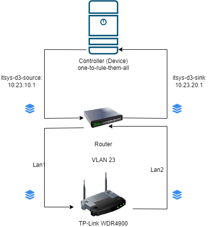

## IT Performance Analysis - Team 5 (Arjun Vishnu Prakash , Eldhose Paul)

### Table of Contents

1. [Problem definition](#1-problem-definition)
2. [Environment Setup](#2-environment-setup)
3. [Error Discussion](#3-error-discussion)
4. [Experiment Specification](#4-experiment-specification)
5. [Data Analysis & Plotting](#5-data-analysis--plotting)
6. [Results](#6-results)
7. [Conclusions](#7-conclusions)

### 1. Problem Definition

* The objective of this project is to measure and analyze the performance of different network packet processing and
  forwarding techniques through
  the [TP-Link WDR4900 v1](https://static.tp-link.com/resources/document/TL-WDR4900_V1.0_Datasheet.zip) access point (
  termed as `device`).

* Mainly, four packet forwarding techniques are compared in our experiment:-

#### a. IP forwarding:

Internet Protocol (IP) forwarding is a fundamental process where a system, typically a router, forwards incoming data
packets to another network based on the destination IP address. This is essential for routing data across networks and
is the basis of how data gets from its source to its destination over the internet. IP routing defines the shortest path
through which data travels to reach from source to destination. It determines the shortest path to send the data from
one computer to another computer in the same or different network. Routing uses different protocols for the different
networks to find the path that data follows. It defines the path through which data travel across multiple networks from
one computer to other. Forwarding the packets from source to destination via different routers is called routing. The
routing decision is taken by the routers.

#### b. IP forwarding with software offloading:

At current 10 gigabit speeds, TCP/IP processing must be performed using some level of specialized processing technology.
This specialized processing technology is often called TOE (TCP/IP Offload Engine).
TOE technology reduces the load on the host processor by performing TCP/IP computationally intensive tasks such as
checksum processing, connection establishment and teardown, TCP segmentation, reordering, and aggregation.
TCP segment reassembly, congestion management, etc.
By using TOE technology, the system processor can be freed from tedious TCP/IP handling and freed to operate as the
general-purpose application processor for which it was designed.
Using TOE technology can enable better use of network bandwidth and extend the life of existing processors and servers.
TOE technology is not limited to X86 servers.
The need for TOE technology is also evident in PowerPC, MIPS, and other embedded CPU-based content data network
products. There are several different approaches to implementing TOE technology.
The basic purpose of the TOE is to offload some or all of the processing of TCP, UDP, and IP protocols from the host
processor.

#### c. IP forwarding with hardware offloading:

This method further improves network transmission performance by offloading certain data forwarding tasks from the
software to the hardware. This allows for faster packet routing as the hardware can process these tasks more quickly
than the software. This is typically achieved using dedicated hardware components designed specifically for these tasks.

Modern networks are expected to be able to quickly and securely move a large number of data packets. Processing that
data on both the sending and the receiving ends is an expensive operation for servers that are responsible for handling
the network traffic. As the server is performing network operations, its CPUs are spending valuable cycles handling the
networking tasks and, as a result, have fewer cycles available to run the actual applications or process the data. A
practical solution to this problem is to use hardware offloading to transfer resource intensive computational tasks from
the server’s CPU to a separate piece of hardware.

#### d. eBPF (TC):

Extended Berkeley Packet Filter (eBPF) when used with Traffic Control (TC), provides a flexible platform for executing
programs in the kernel space, allowing for fast packet processing and forwarding. eBPF is a technology that can run
sandboxed programs in the Linux kernel without changing the kernel source code or loading kernel modules. When used with
TC, it can classify and take action on network traffic, providing fine-grained control over network packets.
Read more about eBPF in the following links :
<br>

- [What is eBPF?](https://ebpf.io/what-is-ebpf/#what-is-ebpf)
- [tc/BPF and XDP/BPF](https://liuhangbin.netlify.app/post/ebpf-and-xdp/)

### 2. Environment Setup

* The `controller` (named as `one-to-rule-them-all` or Muxer) for the whole setup is a regular x86_64-based Desktop-PC (
  with a Intel i5 750 (4) @ 2.661GHz CPU) , running Arch linux and
  also as a point of access. The controller has a 10-Gigabit connection to the switch.

```commandline
Static hostname: one-to-rule-them-all
       Icon name: computer-desktop
         Chassis: desktop 🖥️
      Machine ID: 831e2bc1f66c44b3935eab17455ca55f
         Boot ID: c2507af09751498085380b35e2f87b9d
Operating System: Arch Linux                      
          Kernel: Linux 6.6.10-arch1-1
    Architecture: x86-64
 Hardware Vendor: FUJITSU
  Hardware Model: ESPRIMO P9900
Firmware Version: 6.00 R1.20.2912.A1              
   Firmware Date: Wed 2010-08-18
    Firmware Age: 13y 5month 3w 1d
```

* The `device` is connected with two cables to the same switch to which the controller is also connected, thus they are
  in a network. To separate all the other devices and it's networks from each other, they are grouped into VLANs. The
  controller has access to all of these VLANs, and thus has a connection to the `device` (using a virtual interface).
  Every connection between a `device` and the controller gets its own unique set of IP addresses.

* Our team(team5) has unique ssh keys that authenticates and authorises our users to access the `device`. This key is
  used along with the device’s
  IP address and the username ‘root’ to connect to the device. An SSH config entry has also been set up in
  the `controller` to make this process easier. <br>

* In network performance experiments, it’s crucial to avoid any unwanted side effects that could distort measurements.
  One such side effect can occur when the device generating traffic is also the one being tested. This is because
  traffic generation is a resource-intensive task and can overload the device, leading to inaccurate results. To avoid
  this, traffic generation and reception are outsourced to a separate, more powerful device, in our case
  the `controller`.
  However, if the `controller` detects that the source and destination of the traffic are the same device, it may bypass
  the device being tested and forward the traffic internally, resulting in unrealistically high throughput. To prevent
  this, we use a feature of the Linux kernel called `namespaces`. Namespaces allow us to create multiple network
  interfaces on the controller that are isolated from each other. This enables us to generate and receive traffic on the
  same device without the operating system recognizing it as such, ensuring accurate and reliable measurements.

* The two connections between your device and the controller use two different subnets for better distinction. They are
  called the source subnet and the sink subnet, within each there is an own IP address space. We (team5) would need to
  use 10.23.10.1 as traffic source IP and 10.23.20.1 as traffic sink IP.

* iperf3 is a tool that uses a client-server model to generate and transmit data, representing traffic source and sink
  respectively. For this setup iperf3 is started in
  separate namespaces on the source and sink. The server listens on all interfaces, and the client connects to the
  server, transmits data, and both print throughput statistics every second.

* Next step is to collect the trace. For this we are using the `tcpdump` tool collects the trace of
  all incoming and outgoing packets. We store the dump to a `.pcap` file and this would be our raw data for further
  processing.

* Inorder to switch between the software and hardware offloading forwarding techniques , we change the respective flags
  in the firewall
  configuration file (`/etc/config/firewall`) and for the eBPF (TC) forwarding, we load the prewritten
  eBPF [program](https://github.com/tk154/eBPF-Tests/blob/main/programs/kernel/router_map.c).

* The setup is depicted in the following diagram.

<br>



### 3. Error Discussion

Following are the possible errors during the setup and experiments.

#### Systematic Errors:

* Environment configuration issues: If the network devices or tools aren’t set up right, they might give wrong data.
* Wrong Normal: If we don’t correctly define what’s “normal” for the network, then it might give out false positives or
  false errors.
* Configuration changes: Two teams are sharing the same device. So any changes to the device configuration during the
  experiment would affect the output.

#### Data Errors:

* Sampling Slip-ups: If we only looking at a sample of our network traffic, we might get a skewed picture if our sample
  isn’t a good representation of the whole.
* Timing : The time when we collect data can affect what we see. Network traffic can change a lot throughout the day.
* Measurement Mix-ups: Problems with our hardware or software can lead to errors in our data.
* Bad Data: If the data we are analyzing is missing information, has duplicates, or is recorded wrong, then our analysis
  won’t be accurate.

#### Random Errors:

* Potential sporadic errors: Sometimes there could be arbitary errors that might affect the outcomes of an experiment
  interation.

### 4. Experiment Specification

We decided to collect traces for each forwarding techniques 10 iterations each with a duration of 60 seconds, first by
using TCP and then with
UDP data transmission protocol. So the number of pcap files are 40, per protocol.

#### Tasks:

##### Data Collection

All these steps are performed on the `controller`.

1. `ssh one-to-rule-them-all`
2. Starting the [iperf3](https://iperf.fr/iperf-doc.php) server in namespace `sink` <br>
   `sudo ip netns exec itsys-d3-sink iperf3 -s`
3. Start [tcpdump](https://www.tcpdump.org/manpages/tcpdump.1.html) in ns `sink` <br>
   `sudo ip netns exec itsys-d3-sink sudo tcpdump -nei ul-sink -w <filename>.pcap`

> Options used : <br>
> * -n : disable DNS resolution <br>
> * -e : capture packet headers <br>
> * -i : specify the interface (`ul-sink`) <br>
> * -w : write output to file <br>

4.Start traffic generation using iperf client on namespace `source` <br>
`sudo ip netns exec itsys-d3-source iperf3 -c 10.23.20.1 -t 60`
> Options & params: <br>
> * -c : client mode
> * IP of the `sink`
> * -t : duration 60s
>
> Note: For UDP traffic we use 2 additional options -ub 1000000000
> * -u : UDP mode
> * -b : bandwidth to use - 1 Gbps

The collected trace files are available
at [](https://doi.org/10.5281/zenodo.10637773).

##### Transfer files to local machine

1. Compress the files <br>
   `tar -Jcvf raw.tar.xz <path/to/dir>`
2. Transfer <br>
   `croc send raw.tar.gz`

> On the local machine we first extract the archive
> `tar -xcvf raw.tar.gz -C <dir>`

##### Generate CSVs

1. After collecting the traces, we filtered out only the iperf traffic using [tshark](https://tshark.dev/) using the following filters:

- source ip is 10.23.10.1
- destination ip is 10.23.20.1
- tcp/udp.port is 5201

`tshark -Y "ip.src == 10.23.10.1 and ip.dst == 10.23.20.1 and tcp.port == 5201" -r <filename>.pcap -w temp_filename.pcap`

> Options:
> * -r : read from pcap file
> * -w : write output to file

2. Using [tcpstat](https://linux.die.net/man/1/tcpstat) generate the statistics from the filtered pcap records <br>
   `tcpstat -F -r temp_filename.pcap -o "%R,%T,%U,%C,%b\n" 1 > file.csv`

The generated CSV files are available [here](data).

#### Automation

We automated most of the major tasks of the workflow i.e data collection and trace filtering & transformation using
shell scripts.

| # | Script                           | Purpose                                  |
|---|----------------------------------|------------------------------------------|
| 1 | [collect.sh](scripts/collect.sh) | Collect traces for a specified mode      |
| 2 | [parse.sh](scripts/parse.sh)     | Filter and parse the pcap files into CSV |

- such as timestamp and bitrate from the individual
  trace files and filter it using the tools such as 
  and  .After that we converted those trace files into .csv files.

### 5. Data Analysis & Plotting

For performance analysis we wrote a python script. Mean, median and standard deviations are the statistical measurements
that we have used.

Libraries used:
- pandas
- numpy
- matplotlib
- plotly
- scipy

Using [python](https://docs.python.org/3/tutorial/index.html) script
and [matplotlib](https://matplotlib.org/stable/api/_as_gen/matplotlib.pyplot.plot.html) and [plotly](https://plotly.com/python/) libraries, we have plotted the
individual iterations into line graphs and calculated the mean, meadian and standard deviations for the 4
forwarding techniques for both protocols (TCP and UDP). 

We then plotted a summary graph into a box plot for performance comparison.

### 6. Results

The results of our experiment including all the line graphs and box plots for comparison are available [here](plots).

The overall results for comparison can be accessed as an interactive box plot [here](plots/summary.html).

### 7. Conclusions

Let's summarize the performance of the four packet processing and forwarding mechanisms:

- IP Forwarding
    - TCP: 214.5 Mbps
    - UDP: 560.1 Mbps
- IP Forwarding with Software Offloading
    - TCP: 281.6 Mbps (an increase of about 31.2% from IP Forwarding)
    - UDP: 924.7 Mbps (a leap of approximately 65.1% from IP Forwarding)
- IP Forwarding with Hardware Offloading
    - TCP: 293.2 Mbps (an increase of approximately 4.1% from IP Forwarding with Software Offloading)
    - UDP: 936.6 Mbps (an increase of about 1.3% from IP Forwarding with Software Offloading)
- eBPF (TC)
    - TCP: 284.9 Mbps (a lower of approximately 2.8% from IP Forwarding with Hardware Offloading)
    - UDP: 965.Eight Mbps (an increase of approximately 3.1% from IP Forwarding with Hardware Offloading)

From those effects, we can infer that for each TCP and UDP, IP Forwarding with Hardware Offloading and eBPF (TC)
provide the best performance. However, the precise choice between these two would rely upon different factors
including the unique necessities of the network and the capabilities of hardware being used. It’s additionally crucial to notice that
while UDP gives higher bandwidth, it does not have the equal reliability and ordering ensured as in TCP. Therefore, the
selection between TCP and UDP might also depend upon the specific needs of user application.

In phases of development from one mechanism to the next, the maximum sizable leap in performance for both TCP and UDP
is seen between IP Forwarding to IP Forwarding with Software Offloading. The next shift to IP Forwarding with Hardware Offloading and eBPF (TC) are much less steeper. This shows that at the same time that
offloading (both software program and hardware) and eBPF (TC) can offer overall performance advantages, but the most
substantial improvement is observed from the plain IP to software offloading.

It’s also well worth noting that the performance decrease determined whilst moving from IP Forwarding with Hardware
Offloading to eBPF (TC) in the case of TCP isn't always discovered in UDP. This might suggest that eBPF (TC) could be well suited for UDP applications.


