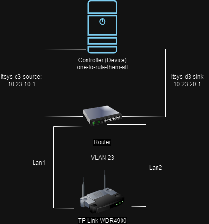

##  IT Performance Analysis - Team 5 (Arjun Vishnu Prakash , Eldhose Paul)

###  Table of Contents
1.  [Problem definition](#problemdefinition)
2.  [Environment Setup](#envirsetup)
3.  [Error Discussion](#errdiscuss)
4.  [Confidence Analysis](#confianalysis)
5.  [Experiment Specification](#expspecifi)
6.  [Data Analysis](#dataanalysis)
7.  [Plottting results](#plotresults)
8.  [Results](#results)
9.  [Conclusions](#conclusion)

<h3> 1. Problem Definition </h3>

  * The objective of this project is to measure and analyze the performance of different network packet processing and forwarding techniques through a TP-Link WDR4900 v1 access point (hereafter referenced as `device`).  
  * Four packet processing and forwarding techniques are considered in our experiment:-

<h4> IP forwarding:</h4>

      This is a basic method where a system (usually a router) sends incoming packets to another network based on the destination IP address.

<h4>  - IP forwarding with software offloading:</h4>

        This technique enhances performance by offloading some data forwarding tasks from the CPU to a more efficient part of the system.

<h4>  - IP forwarding with hardware offloading:</h4>

      This method improves transmission performance by offloading certain data forwarding tasks from the software to the hardware, allowing for faster packet routing.

<h4>  - eBPF (TC):</h4>

      eBPF, when used with Traffic Control (TC) provides a flexible platform for executing programs in the kernel space, allowing for fast packet processing and forwarding.

<h3> 2.  Environment Setup </h3>

   * The controller (named as `one-to-rule-them-all` or Muxer) for the whole setup is a regular x86_64-based Desktop-PC (with a Intel i5 750 (4) @ 2.661GHz CPU) , running  on OpenWrt linux distribution ( SNAPSHOT, r24403+283-c23b509d72) and  also as a point of access. The controller has a 10-Gigabit connection to the switch.  

   * The `device` is connected with two cables to the same switch to which the controller is also connected, thus they are in a network. To separate all the other devices and it's networks from each other, they are grouped into VLANs. The controller has access to all of these VLANs, and thus has a connection to the `device` (using a virtual interface). Every connection between a `device` and the controller gets its own unique set of IP addresses, and there’s a list that shows which of these addresses are used by the devices and the controller’s virtual interfaces.  

   * Our team(team5) has a unique ssh key that it can use to access the `device`. This key is used along with the device’s IP address and the username ‘root’ to connect to the device. An SSH config entry has also been set up  in the `controller` to make this process easier.   

   * In network performance experiments, it’s crucial to avoid any unwanted side-effects that could distort measurements. One such side-effect can occur when the device generating traffic is also the one being tested. This is because traffic generation is a resource-intensive task and can overload the device, leading to inaccurate results. To avoid this, traffic generation and reception are outsourced to a separate, more powerful device, known as the `controller`. However, if the `controller` detects that the source and destination of the traffic are the same device, it may bypass the device being tested and forward the traffic internally, resulting in unrealistically high throughput.To prevent this, we use a feature of the Linux kernel called `namespaces`. Namespaces allow us to create multiple network interfaces on the controller that are isolated from each other. This enables us to generate and receive traffic on the same device without the operating system recognizing it as such, ensuring accurate and reliable measurements.  
 

 

   * The two connections between your device and the controller use two different subnets for better distinction. They are called the source subnet and the sink subnet, within each there is an own IP address space. We (team5) would need to use 10.23.10.1 as traffic source IP and 10.23.20.1 as traffic sink IP.  
 

 

   * iperf3 is a tool that uses a client-server model to generate and transmit data, representing traffic source and sink respectively. It’s started with iperf3 on the server side and  on the client side. For this setupiperf3 is started in separate namespaces for the source and sink. The server listens on all interfaces, and the client connects to the server, transmits data, and both print throughput statistics every second.  

   * Next step is to collect the trace. For this we are using the `tcpdump` tool that hooks onto a network interface and captures all incoming and outgoing packets, and can print that on the screen or write in into a pcap file.  

   * Inorder to switch between the software and hardware offloading forwarding techniques , change the firewall configuration file (/etc/config/firewall) and for the eBPF (TC) forwarding, we load the prewritten eBPF program.  
 

   * The setup is depicted in the following diagram.   
  

  
  

<h3> 3. Error Discussion </h3>
The following are the possible errors during this setup and and operation. 
<h4>Systematic Errors: </h4>
     * Setup Mistakes: If the network devices or tools aren’t set up right, they might give  wrong data. 
     * Wrong Normal: If don’t correctly define what’s “normal” for the network, then it might miss problems or see problems where there aren’t any. 
     * Biased Algorithms: The methods we use to analyze traffic might have built-in biases that can twist the results. 
<h4>Random Errors:  </h4>
     * Sampling Slip-ups: If we only looking at a sample of our network traffic, we might get a skewed picture if our sample isn’t a good representation of the whole. 
     * Time Troubles: The time when we collect data can affect what we see. Network traffic can change a lot throughout the day. 
     * Measurement Mix-ups: Problems with our hardware or software can lead to errors in our data.  
<h4>Other Potential Errors:  </h4>
     * Bad Data: If the data we are analyzing is missing information, has duplicates, or is recorded wrong, then our analysis won’t be accurate. 
     * Changing Threats: Cyber threats are always changing, and our analysis tools might not be able to keep up. 
     * Encryption Issues: As more network traffic gets encrypted, it’s harder to analyze for potential threats.  
<h3> 4.  Confidence Analysis </h3>
<h3> 5.  Experiment Specification </h3>
  We have planned to conduct each forwarding techniques 10 iterations with a duration of 60 seconds and by using TCP and UDP data transmission protocol. So in total the number of `tcpdump` output files are 40 numbers in each protocol. You can access the collected `tcpdump` output files [here](https://zenodo.org/uploads/new)
    
<h3> 6.  Data Analysis </h3>
   For performance analysis we use python scripting. Mean, median and standard deviations are the numerical measurements that we have used.  
   The script that we used are displayed below and also access those files with this link.[Link Text](https://www.example.com)
<h3> 7.  Plottting results </h3>
   For plotting the results, first we have extracted the necessary fields such as timestamp and bitrate from the individual trace files and convert it into .csv files. With the help of python script and matpolib libraries, we have plotted the individual iterations into line graphs and calculated the mean, meadian and standard deviations for each packet forwarding techniques. Based on the calculated numerical measures, we then plot the aggregated statistical measures into a box plot for performance comparison. 
   
<h3> 8.  Results </h3>
  
<h3> 9.  Conclusions </h3>
   * Justification

